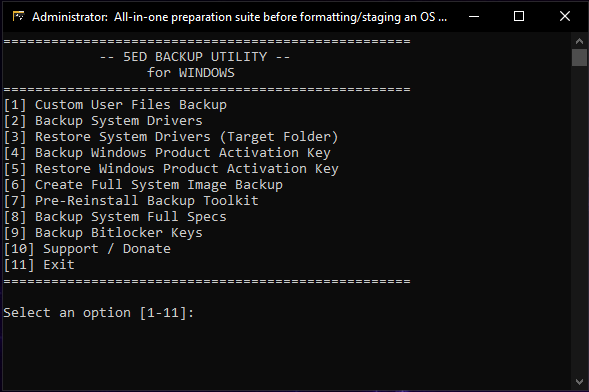

# 5ED Backup Utility
# 5ED Backup Utility

An all-in-one preparation suite for formatting and staging Windows OS environments.

---

## 📖 About the Tool
The **5ED Backup Utility** is a comprehensive preparation suite designed to run before formatting, staging, or clean-installing a fresh operating system. It automates critical data preservation and system archiving tasks through an intuitive, lightweight command-line menu. This utility is built specifically to save time for **IT Technicians**, **System Administrators**, and **Power Users**.

---

## 🚀 Key Features

* **Custom User Files Backup:** Easily safeguard personal documents, profiles, and critical user data.
* **Driver Management:** Export, backup, and target-restore system drivers to streamline post-installation setups.
* **Windows Activation:** Securely view, backup, and restore your native Windows product activation keys.
* **Full System Image:** Create a comprehensive backup of the entire current OS state.
* **Pre-Reinstall Toolkit:** A bundled 3-in-1 pre-reinstall suite configured for maximum deployment speed.
* **Hardware Profile Archive:** Export a detailed report of the system's full hardware and software specifications.
* **BitLocker Key Backup:** Safely extract and backup active BitLocker recovery keys before undergoing major partition modifications.

---

## ⚙️ System Requirements & Privileges

* **Supported OS:** Windows 10 / Windows 11
* **Execution Rule:** Must be executed with **Administrative Privileges** to access system drivers, registry keys, and BitLocker states.
  * *To run:* Right-click the file and select **"Run as administrator"**.

---

## 💻 How to Use

1. Run the compiled executable file as an administrator.
2. Confirm that the terminal window display header includes `"Administrator:"`.
3. Input a number from **1 to 11** corresponding to your target task.
4. Press `[ENTER]` to initialize the selected backup module.
5. Follow any contextual on-screen prompts or folder path destinations.

---

## ⚠️ Important Notes

* **Antivirus False Positives:** Because this utility is compiled from a batch (`.bat`) script into a standalone `.exe`, some strict antivirus heuristic scanners may trigger a false positive flag. You may need to temporarily whitelist the executable or allow it through your security suite if it gets blocked.
* **Storage Allocation:** Always verify that your target external backup drive or network share has sufficient free storage space before executing full system images or heavy user profile data backups.

---

## ⚖️ Disclaimer
This utility is provided "as is" without warranty of any kind, express or implied. While this tool is designed to safely preserve data, **5EDevelopment** is not responsible for any accidental data loss, hardware damage, or failed OS installations. Always manually verify that your critical files have been successfully backed up to your external storage media **before** formatting or erasing your drive.

---

## 👥 Contributors & Credits
* **[5EDevelopment](https://github.com)** - Lead Developer & Project Maintainer

*Contributions, issues, and feature requests are welcome! Feel free to check the issues page if you want to contribute to the project script.*
